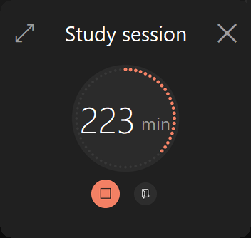
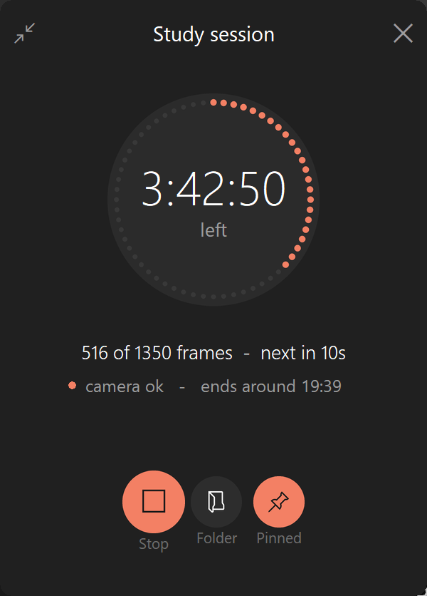

<p align="center">
  
</p>

<h1 align="center">Study Time-Lapse</h1>

**Turn a six-hour study session into a 45-second time-lapse.** A lightweight
Windows desktop app that photographs you with your webcam at a computed
interval, then stitches the frames into a video.

[](LICENSE)


You say *"6 hours of study, 45 seconds of video, 30 fps"* and it works out the
rest: 1350 photos, one every 16 seconds.

It is built to survive a real study session rather than a demo — it shares the
webcam with your video calls, keeps the PC awake, notices if it sleeps anyway,
and resumes where it left off if it is closed or crashes.

- **~44 MB resident, near 0% CPU** — the recorder never loads OpenCV
- **Tiny videos** — x264/x265 tuned for frames that barely change:
  a 3200-frame session is ~20 MB, not 370 MB
- **Your camera stays free** — held for about a second per shot, then released

<p align="center">
  
  &nbsp;&nbsp;
  
</p>

<p align="center"><i>Compact widget, and the expanded panel. The arrow top-left swaps between them.</i></p>

Two separate apps:

| | |
|---|---|
| **`Capture.bat`** | Takes the photos. Configure once, then it sits in the background. |
| **`Render.bat`** | Turns photo folders into a video. Run it whenever, on one session or several. |

They are deliberately independent: nothing about the video is decided while
recording, so the same photos can be re-rendered at any frame rate or length,
and several sessions can be joined into one video.

## Quick start

1. Double-click **`Capture.bat`**.
2. Set how long you'll study, how long the video should be, and the frame rate.
3. Pick your camera **by looking at the thumbnails** — Windows does not give a
   dependable index-to-name mapping, and one of the entries may be the infrared
   Windows Hello camera.
4. Hit **Start session** and get on with studying.
5. Afterwards, double-click **`Render.bat`**, tick the session, and render.

While recording, the window sits on top as a small widget. The arrow in its
top-left corner expands it to the full panel — with the frame count, camera
state and finish time — and collapses it again. Both views are borderless and
drag from anywhere on their body.

## How the interval is worked out

```
photos needed = video length x frame rate
interval      = study duration / photos needed
```

6 hours into a 45-second video at 30 fps is `45 x 30 = 1350` photos, one every
**16 seconds**. The setup screen shows this live, along with the estimated disk
usage and the finish time.

A shot takes roughly 1.3 seconds, so the app refuses any combination needing a
photo more often than every 3 seconds and tells you the longest video that
setting can produce instead.

## Where things are saved

Inside your **Pictures** folder (resolved from Windows, so a redirected or
OneDrive Pictures folder works):

```
Pictures\StudyTimeLapse\
  2026-08-22_14-30-05\        one folder per session
    session.json              settings and progress
    frames.jsonl              append-only log, one line per photo slot
    frames\
      000001.jpg
      000002.jpg
    timelapse_30fps.mp4       written by the renderer
```

Photos are **kept** after rendering so you can re-render later. A 6-hour
session is roughly 200–700 MB depending on resolution and quality.

File names are keyed to the slot number, so a gap in the numbering is the
record of a missed shot.

## What it does about the awkward cases

**You're in a call.** The camera is only held for about a second per shot and
released immediately, so Zoom or Teams can use it the other 15. If a shot is
missed anyway the slot is logged and retried at the next interval — the session
never dies, and it recovers by itself once the camera is free. The status line
shows `camera busy - retrying` while this is happening.

> Note: on Windows a second app can usually *open* the camera but gets starved
> of frames, so "busy" normally shows up as a frame timeout rather than an
> outright failure to open. Both are handled the same way.

**Your PC sleeps.** While a session runs the app asks Windows to stay awake
(the screen is still allowed to switch off). If sleep happens anyway — closing
the lid forces it — the app notices on wake, does **not** count the sleep as
study time, and pushes the finish time back so you still get your full session.

**You close the app or it crashes.** Progress is written continuously, so
relaunching offers to resume: *"412 of 1350 photos captured, 4h 12m of study
left. Resume it?"* Photo numbering continues where it left off.

**Camera unplugged, disk full, camera ignores the requested resolution, black
warm-up frames, an early stop** — all handled; see the status line and the
notice under it.

## Renderer options

- **Frame rate** — 24 / 30 / 45 / 60, or type your own.
- **Length** — *All frames* (duration = frames ÷ fps), or *Exactly N seconds*,
  which resamples evenly, dropping or duplicating frames as needed.
- **Hold previous frame across missed shots** (on by default) — keeps motion
  smooth and the running time honest. Turn it off to simply skip gaps.
- **Resolution** — source, or a fixed size. Mixed sources are letterboxed, never
  stretched, so merging sessions from different cameras is safe.
- **Quality** — *Smallest file* / *Balanced* / *High quality*, and the codec:
  H.264 (plays everywhere) or H.265 (roughly half the size, needs a newer
  player).
- **Reduce camera noise** (on by default) — a light denoise before encoding.
- Tick **several sessions** to concatenate them in date order.

## About the file size

A study time-lapse is unusually compressible: the same room, the same camera,
the same light, and a subject who barely moves, so nearly everything in a frame
is already in the frame before it. The renderer leans on exactly that — x264 or
x265 at constant quality (CRF), long GOPs with scene detection off, and extra
B-frames and reference frames so a returning pose can be predicted from further
back.

The one thing fighting it is webcam sensor noise, which changes in every pixel
of every frame and looks like real detail to an encoder. The optional denoise
pass removes it, and on its own is worth about a third of the file size.

A real 3207-frame, 720p session measured three ways:

| | |
|---|---|
| OpenCV's own writer (what this used to do) | **370 MB** |
| H.264, *Balanced* | **20.7 MB** |
| H.265, *Smallest file* | **3.9 MB** |

Everything is decided at render time, so re-rendering an old session with a
different quality costs nothing but the encode.

## Requirements

Windows, and Python 3 with:

```
pip install opencv-python pillow numpy psutil pywin32 imageio-ffmpeg
```

`imageio-ffmpeg` is what makes the videos small — it ships an `ffmpeg` binary
with x264 and x265, which the renderer drives over a pipe. A system-wide
`ffmpeg` on `PATH` (or one dropped in `bin\ffmpeg.exe`, or pointed at by
`STUDY_TIMELAPSE_FFMPEG`) is used just as happily.

Without any of them the renderer still works, falling back to OpenCV's own
writer — but that has no quality control at all and produces files roughly 15x
larger, so the window says so under *Save to*.

`tkinter` ships with Python. Then just double-click `Capture.bat`.

The Windows-only parts are the sleep lock (`SetThreadExecutionState`), the
known-folder lookup for Pictures, and the WMI camera names — each already falls
back gracefully, so porting to macOS or Linux is mostly a matter of replacing
those three.

## Layout

```
Capture.bat          launch the recorder
Render.bat           launch the video maker
src/
  capture.py         App 1: setup screen, session clock, both recording views
  render.py          App 2: session browser and render window
  encoder.py         FFmpeg/OpenCV encoders and the compression settings
  grabber.py         one-shot camera helper, spawned per photo and per probe
  common.py          paths, session manifest, slot clock, formatting
  theme.py           palette, DPI handling, rendered ring and buttons
assets/              logo.png, logo.ico
docs/                screenshots
```

### About the interface

The recording views are drawn on a canvas rather than assembled from widgets,
because Tk draws shapes without antialiasing and circles came out harsh. The
ring and the round buttons are rendered with Pillow at 4x and downsampled;
text is left to Tk, which Windows already antialiases. The palette and the
compact view's proportions were measured from a screenshot of the Windows 11
Clock focus-session widget.

The app also declares itself DPI-aware. Without that Windows bitmap-scales the
whole interface on a high-DPI display, which is why unaware apps look soft next
to native ones. All geometry is therefore written in logical units and
multiplied by the display scale.

`capture.py` never imports OpenCV. Every photo is taken by a throwaway
`grabber.py` subprocess, which keeps the resident process at about **44 MB** and
near 0% CPU, and guarantees the camera handle is released by process exit even
if a driver misbehaves. A hung camera kills a disposable subprocess instead of
your six-hour session.

## Contributing

Issues and pull requests are welcome. The code has no build step and no test
framework dependency — `common.py` deliberately keeps the awkward logic (the
slot clock, suspend detection, sequence building) free of any UI so it can be
exercised directly.

## License

[MIT](LICENSE) © 2026 Amine Cheikhrouhou
